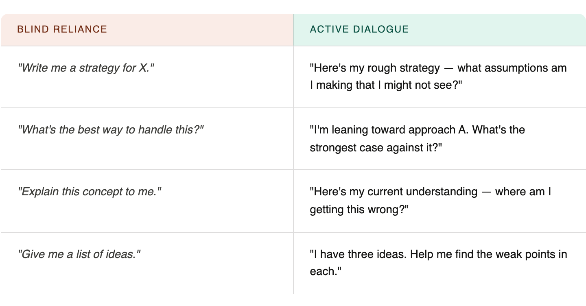

The most powerful thing you can do with an AI isn't get answers from it —
it's use it to sharpen the questions only you can answer.

{/* truncate */}

There is a version of AI — how you use it — that makes you more yourself.
And there is a version that slowly makes you a passive passenger in your own
mind. This essay is about knowing the difference.

When most people first get access to a capable AI model, they use it the way
they use a search engine on steroids: type in a question, get an answer,
close the tab. This is not wrong. It's just shallow. It's the equivalent of
hiring a world-class conversation partner and only ever asking them for
directions. I am guilty of this too, but in recent days I've come to
realize what this habit actually takes from us — our identity in our own
work. I have seen peers who just copy-paste responses from AI without
giving it a single thought — not even a glance, no edits, no questioning,
just blind copying. And there's something quietly troubling about that, not
because the output is always wrong, but because the person has completely
disappeared from it.

This led me to think deeper, where I found a far more interesting way to use
AI: as a thinking companion — something you push back against, test your
ideas with, use as a mirror and a foil. Not a replacement for thought, but a
catalyst for it.

I stumbled onto this by accident — going back and forth with AI on an idea
for a project, turning it over, poking at it, letting the conversation run.
At some point something had shifted. When you ask AI to criticize your
thinking instead of replace it, when you ask the right questions instead of
outsourcing the answers, it stops just reflecting your ideas back at you. It
starts pushing against them — questioning assumptions I hadn't noticed I'd
made, playing devil's advocate in a way that didn't just challenge my idea
but pulled more thought out of me, deeper thought, and better thought. It
wasn't a mirror. It was a sparring partner. That discovery changed how I use
it entirely: not as a thinking substitute, but as a thinking catalyst —
something that provokes, pressures, and sharpens rather than simply
responds.

## The Trap of Epistemic Outsourcing

Here is what happens when you outsource your thinking to AI: the model
gives you something fluent, coherent, and confident-sounding. You read it,
it seems reasonable, and you move on. But the ideas were never yours. You
never held them under pressure. You never felt the friction of figuring
something out.

This is what philosophers call epistemic outsourcing — delegating the hard
work of forming beliefs to an external system. It's seductive because it's
frictionless. But frictionless is another word for effortless, and effort
is exactly how thinking gets stronger.

> The goal isn't to receive better answers. It's to become someone who asks
> better questions — and AI is a surprisingly good sparring partner for
> that.

The antidote isn't to use AI less. It's to use it differently.
Specifically: use it as a thinking environment, not a thinking substitute.

## What a Thinking Companion Actually Does

A good thinking companion — human or artificial — does a few specific
things. They don't just agree with you. They reflect your reasoning back at
you in a way that lets you see it more clearly. They ask questions you
hadn't thought to ask. They offer an alternative frame you can push
against.

A real thinking partner:

- **Reflects** — Plays your ideas back to you so you can see what you
  actually believe, not what you meant to believe.
- **Challenges** — Offers the strongest version of the opposing view, so
  you can sharpen your own position, not just reinforce it.
- **Expands** — Introduces adjacent ideas, analogies, and disciplines you
  wouldn't have found on your own.
- **Focuses** — Asks: what's the actual question here? Cuts through fog
  when your thinking is still too vague to be useful.

AI can do all four — but only if you prompt it in a way that invites
dialogue, not monologue. The biggest mistake is treating AI like an oracle.
Oracles speak; companions think alongside you.

## Blind Reliance vs. Active Dialogue

The difference between passive and active AI use isn't about how much you
use it. It's about your orientation toward it. Are you receiving, or are
you engaging?

Notice the shift: active dialogue starts with you. Your thinking comes
first. The AI responds to your reasoning, not instead of it. This means the
output is always in dialogue with something you already thought — which
means you can actually evaluate it, agree or disagree, and refine your
position.

## Five Practices to Make AI a Real Thinking Partner

### 01. Lead with your half-formed thought, not your question

Before asking AI anything, write down what you already think — even if it's
vague and messy. Then share that with the AI and ask it to respond to your
thinking, not to the topic in the abstract. Your imperfect draft is more
valuable than a clean prompt.

### 02. Ask for the steelman, not just the answer

When you're considering a position, ask AI for the best possible argument
against it. Not the obvious objection — the deepest, most uncomfortable
one. Then sit with it. Can you actually respond? This is how positions get
stronger.

### 03. Disagree deliberately

When an AI gives you an answer that feels right, push back anyway. Say:
"I'm not sure I buy this." See how it responds. Sometimes you'll find the
answer was shallower than it appeared. Sometimes you'll discover your
objection doesn't hold. Either way, you've thought harder than if you just
accepted the first output.

### 04. Use it to find your blind spots, not your beliefs

Instead of asking "Am I right about X?", ask "What am I likely missing
about X given my background?" or "What would someone who completely
disagrees with me say about this?" AI is good at populating the adjacent
space around your thinking.

### 05. Synthesize out loud, in your own words

After a productive AI conversation, close the window and write a paragraph
— without looking — about what you now think and why. If you can't, the
understanding was the AI's, not yours. If you can, you've actually learned
something. This single habit separates passive consumers from active
thinkers.

### 06. Don't stop at the first answer — keep the conversation alive

Most people treat an AI response like the end of a conversation. It isn't.
It's the beginning of one.

The real value isn't in the first answer — it's in what you ask next. When
AI explains something, your job is to immediately ask a follow-up that goes
one level deeper: "Why does that work?", "What breaks down if I push this
further?", "Can you give me a concrete example of that failing?", "What
does someone who deeply understands this know that your explanation just
skipped over?"

This is how understanding actually forms. Not by absorbing a clean summary,
but by pulling at the threads until the structure underneath becomes
visible to you. Real comprehension has texture — you know where something
gets complicated, where the exceptions live, what the edge cases are. A
single answer gives you a surface. A dialogue gives you depth.

Think of it like a Socratic conversation: you receive an idea, you question
it, the questioning reveals a gap, you question the gap, and slowly —
through that back and forth — the concept becomes yours. You stop knowing
what the AI told you and start knowing the thing itself.

Try this the next time you're learning something with AI:

1. Ask your initial question and read the answer.
2. Identify the one thing you don't fully follow or that feels too neat.
3. Ask specifically about that — "That part about X feels too simple. What
   am I missing?"
4. Repeat until you hit the point where you genuinely can't formulate the
   next question. That's usually where real understanding begins.

The goal isn't a longer conversation. It's a more honest one — one where
you keep asking until the idea stops being the AI's and starts being yours.

### 07. Remember: AI cannot own the decision — only you can

This is perhaps the most important point of all, and the one most people
gloss over.

AI can map out pros and cons with impressive fluency. It can anticipate
second-order consequences, flag risks, and present tradeoffs in a clean,
balanced way. But it cannot tell you which tradeoff is worth making for
you. It cannot weigh your values, your risk tolerance, your relationships,
your long-term vision — because it doesn't have skin in the game. It won't
be there when the consequences arrive.

Thinking ahead — really thinking ahead — means asking: What am I willing to
sacrifice? Where am I prepared to compromise, and where is that a line I
won't cross? Those aren't analytical questions. They are questions of
identity and responsibility. Only you can answer them, because only you
will live with the outcome.

The same is true for your idea's vision. AI can help you refine an idea,
pressure-test it, and build on it. But it has no stake in whether the idea
succeeds or fails. It has no memory of why you started, no attachment to
what the thing is supposed to mean. That thread of meaning — from your
original impulse to your final decision — is something only you can hold.
The moment you let AI hold it for you, you've stopped building your vision
and started executing someone else's suggestion.

Use AI to think through the landscape of a decision. Then close the
laptop, sit with the weight of it, and choose. That act of choosing — with
full awareness of the tradeoffs and full ownership of the outcome — is
irreducibly human. It's also where the most interesting growth happens.

## The Deeper Principle

There's an old saying in philosophy: you only truly understand an idea when
you can argue against it. AI makes it easier than ever to find articulate
arguments — on every side of every question. The risk is using this power
to feel like you understand things you've never actually wrestled with.

The opportunity is using it to wrestle harder, faster, and with more
intellectual diversity than any single human mind could manage on its own.
That's genuinely new. That's what most people are leaving on the table.

The point isn't to be suspicious of AI answers. Many of them are good. The
point is to maintain the habit of having your own thoughts first — thoughts
you can test, refine, and own. AI is a fantastic interlocutor. But you need
to show up as a thinker, not as an audience.

> Think of it like a sparring partner in martial arts. You don't spar to be
> hit — you spar to discover where your guard is open.

The conversations that change how I think are rarely the ones where I got a
clear answer. They're the ones where a response surprised me — made me
realize I'd been holding an assumption I didn't know I had, or framing a
question in a way that made the answer invisible.

That kind of thinking takes a particular posture: staying curious about
your own mind, not just curious about the world. AI can accelerate that,
but only if you bring the curiosity.

## A Final Note on Calibration

AI is also, importantly, imperfect. It hallucinates. It hedges. It
sometimes produces smooth-sounding nonsense with total confidence. Part of
using AI well is developing the calibration to notice this — which, again,
requires that you come to the conversation with your own thinking already
engaged.

A person who outsources all their thinking to AI has no basis for knowing
when the AI is wrong. A person who uses AI as a dialogue partner has their
own reasoning to compare against. The difference matters enormously.

So use the tools. Use them generously, and often. Just stay on the other
side of the dialogue — the side that thinks.

Start your next conversation differently. Before asking AI anything today,
write one sentence of what you already think. Then let it respond to you —
not to the void.
